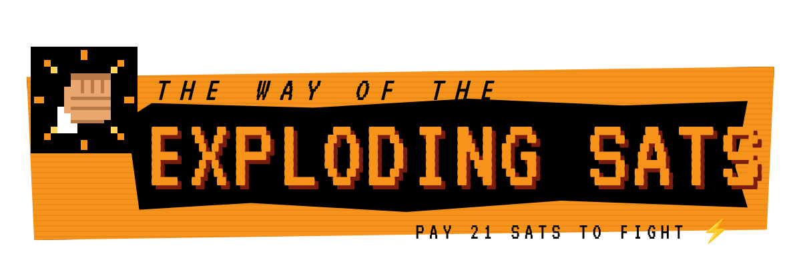
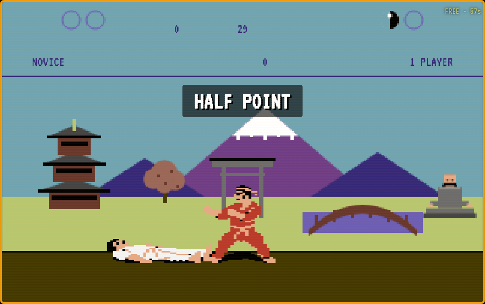

<p align="center"></p>

A faithful browser tribute to the 1985 C64 karate classic **The Way of the Exploding Fist**, powered by Bitcoin Lightning and Nostr.

Pay 21 sats to fight. Publish your grade and score to the decentralized leaderboard.



## Features

- **The original control chart** - 8-way joystick plus one fire button. Direction alone walks, jumps, crouches, punches and somersaults; direction with fire kicks: flying kick, high/mid/jab kick, forward and backward sweep, roundhouse (release early for an about-face) and high back kick. All directions are facing-relative, just like the C64.
- **Original scoring** - every landed blow knocks the opponent down for a full yin-yang (clean hit) or half a yin-yang (poor hit). First to two full points wins the bout. Remaining seconds on the 30 second clock pay 100 points each.
- **Grading** - Novice, then 1st to 10th Dan. Each grade is two bouts; win both and you are promoted to a new arena and a sharper opponent. Lose a bout and the match is over.
- **Four arenas** - pagoda and torii gate under Fuji, the seaside, the dojo, and the Great Buddha, with the seated sensei judging from the sidelines.
- **Bull bonus round** - after the fourth arena a bull charges in. Somersault over it or stop it with a low punch on the nose.
- **Two-player mode** - four bouts, highest total score wins.
- **Attract mode** - the game boots into a CPU vs CPU demo, as the original did.
- **Lightning payments** - 21 sats per match via any Lightning wallet (NWC, WebLN or invoice).
- **Nostr leaderboard** - scores signed by the game key and published as Gamestr events.
- **Free play mode** - one minute to try the moves (scores not publishable).

## How to Play

1. **Pay to fight** - click "Pay 21 sats to fight" and pay with your Lightning wallet.
2. **Move** - the original C64 keys: `Q W E / A D / Z X C` are the eight joystick directions and left `Shift` is fire (arrow keys and `Space` also work). Gamepads work (stick or D-pad plus any button). On touch devices a virtual joystick and fire button appear.
3. **Fight** - see the MOVES dialog in-game for the full chart. Sweeps can't be blocked, so jump them. Duck the flying kick. Hold back to block.
4. **Compete** - login with Nostr and save your score to the leaderboard.

Player 2 uses the original's second layout: `P [ ] / L ' / , . /` with right `Shift` (or `Enter`) as fire (the C64 keys were `P @ * / L ; / , . /`).

## Tech Stack

Same stack as [Space Zappers](https://spacezappers.com):

- React 18 + TypeScript + Vite
- TailwindCSS + shadcn/ui
- Nostrify (Nostr protocol)
- LNbits (Lightning payments via LNURL-pay)
- HTML5 Canvas at 320x200, pixel-scaled

## Development

```bash
npm install
npm run dev      # game on http://localhost:8088, score service on 8089
npm run test     # TypeScript, ESLint, Vitest, then production build
npm run build
```

Create `.env.local` with the game's Nostr key for the score service:

```
GAME_NSEC=nsec1...
VITE_GAME_PUBKEY=<64-char-hex-pubkey>
```

And `.env` with the Lightning configuration (see `.env.example`):

```
VITE_LNBITS_URL=https://your-lnbits-instance
VITE_LNBITS_INVOICE_KEY=<invoice/read key of the receiving wallet>
VITE_LIGHTNING_ADDRESS=your.game@your-lnbits-instance
VITE_GAME_PUBKEY=<64-char-hex-pubkey>
```

## Lightning Payment Flow

1. The game requests an invoice from the Lightning address (LNURL-pay).
2. The player pays with any Lightning wallet.
3. The game polls the LNbits wallet for the payment hash until it is paid.
4. The match starts.

## Nostr Integration

Scores use the [Gamestr](https://gamestr.io) kind 30762 event, signed by the game's key so players cannot forge scores. The `level` tag holds the grade index (0 = Novice, 10 = 10th Dan). See [NIP.md](./NIP.md).

## Deployment

A single container serves the game (nginx) and the score signing service (Node.js):

```bash
docker build -t exploding-sats \
  --build-arg VITE_LNBITS_INVOICE_KEY=<invoice key> \
  --build-arg VITE_LIGHTNING_ADDRESS=your.game@your-lnbits-instance .
docker run -d --name exploding-sats -p 3004:80 -e GAME_NSEC=nsec1... exploding-sats
```

On black-panther the container is defined in the apps-stack docker-compose (see CLAUDE.md).

## Project Structure

```
├── src/
│   ├── pages/Game.tsx             # Payment flow, input, overlays, leaderboard
│   ├── components/
│   │   ├── FistCanvas.tsx         # 320x200 world scaled 3x with HUD text
│   │   ├── JoystickControls.tsx   # Touch joystick + fire
│   │   └── ui/                    # shadcn/ui components
│   ├── lib/
│   │   ├── fistEngine.ts          # Rules, moves, AI, scoring, bull round
│   │   ├── fighterSprites.ts      # The 44 original fighter poses (BBC Micro data)
│   │   ├── fighterAnimation.ts    # Per-move sprite sequences from the original frame tables
│   │   ├── fistRenderer.ts        # Arenas, sensei, fighters, bull, HUD
│   │   └── fistAudio.ts           # Kiai, crack, thud, SID-style music
│   └── hooks/
│       ├── useGameScores.ts       # Leaderboard queries
│       └── useLNbitsPayment.ts    # Invoice + payment polling
└── score-service/                 # Score signing microservice (kind 30762)
```

## Branding

`docs/logo.png`, `docs/screenshot.png`, `docs/social-preview.png` and `public/og-image.png` are rendered by `scripts/render-branding.js` from the HTML templates in `docs/branding/` (VT323 pixel font, Bitcoin orange on black, the fist from the favicon). Re-run it with the dev server up whenever the look changes:

```bash
node scripts/render-branding.js
```

## Credits

The Way of the Exploding Fist (1985) was designed by Gregg Barnett at Beam Software and published by Melbourne House; the BBC Micro conversion was by Michael Simpson. The fighter sprites are decoded from the BBC Micro version using the [Level 7 disassembly](https://www.level7.org.uk/miscellany/the-way-of-the-exploding-fist-disassembly.txt) and remain the copyright of their original creators. This is an unaffiliated, non-commercial fan tribute.

Built with [MKStack](https://soapbox.pub/mkstack).
